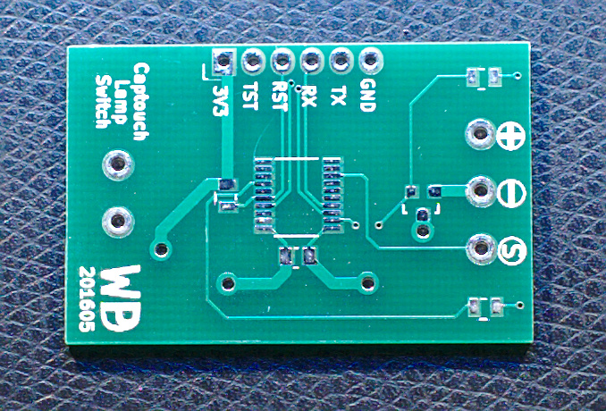
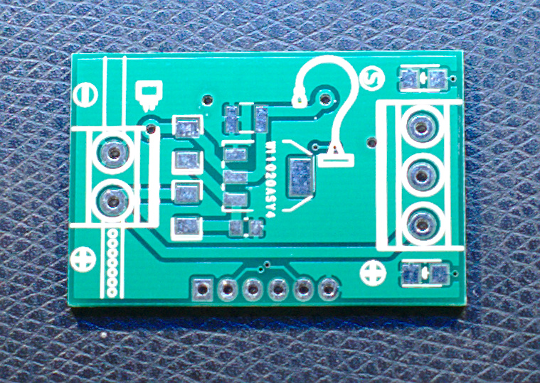
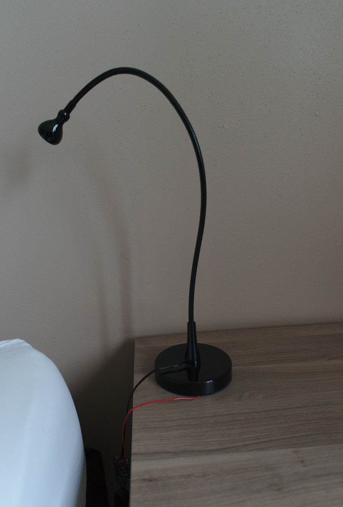

Noisy captouch
==============

Toggling a lamp by touching its plastic base.

This project adds capacitive touch to an IKEA Jansjo light. An MSP430 on a
custom pcb is installed in between the lamp power supply and the lamp. The
MSP430 detects touches using a sensor pad in the base of the lamp, under the
ABS cover.

Features:
- Uses WDT to gate measurements, PinOsc in GPIO input structure, so low power
- Uses an averaging window as a moving baseline, allowing gradual drift

Because of the averaging inputs and allowances for drift can deal with very
noise inputs at the expense of sensing speed (roughly once every second).
