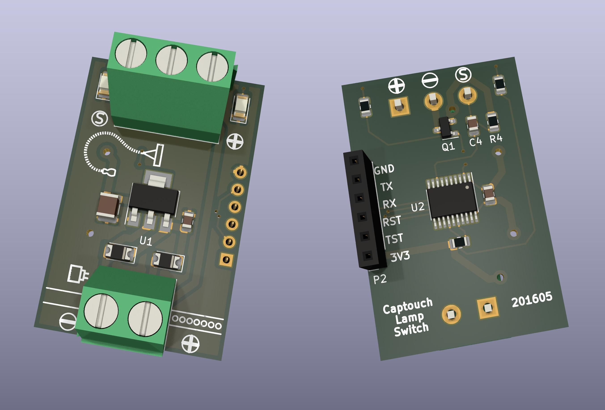

Noisy captouch
==============

Toggling a lamp by touching its plastic base.

This project adds capacitive touch to an IKEA Jansjo light. An MSP430 on a
custom pcb is installed in between the lamp power supply and the lamp. The
MSP430 detects touches using a sensor pad in the base of the lamp, under the
ABS cover.

Touch algorithm
---------------
The measurement happens in a number of steps:
- first we build up a sliding sample window of 16 measurements
  (sum). This also provides us with a moving average (sum/16).

- we calculate a derivative = moving average - current measurement.

- if the derivative is positive: the measurement indicates that the
  counter wrapped less times than expected; which can be an indication
  of increased capacitance due to a touch event.

- if the derivative is higher than a preset threshold (minimum
  required change) we add part of it to the integral. Note that only
  part is considered, to make sure we need multiple "positive"
  measurements in sequence before we signal a touch event.

- if the integral has reached a preset threshold we signal a touch
  event, if not, we leak away some of our integrand to make sure the
  integral reports over a recent period only.

This algorithm tries to cater for a number of things:

- Atmospheric changes will change the measured capacitance, so we must
  take measurement drift into account.

- The electrodes are very sensitive and will pickup any large enough
  emf spikes, so we cannot trust single measured capacitance changes.

- If the emf spikes are high enough almost arbitrary measurements are
  possible, so we need to limit their contribution to integrand.

Complications
-------------

1. Power for the msp430 comes from a wallwart that also feeds the
   lamp. When the lamp is off, only the msp430 is drawing
   current. When the lamp is on an additional 500mA is drawn from the
   wallwart. This transition causes unwanted powersupply noise that
   interferes with the measurements.

2. When programming and debugging the ground is connected to the
   programmer ground. The effect of point 1 can then be
   underestimated. It is best to use an usb isolator when programming.

3. There are no right values for the capacitive touch thresholds, as
   these depend on the capacitive measurement, which in turn depend on
   your touch pad geometry. Especially for home built arbitrary sized
   pads as lamp bases, the values will differ between pads.

USCI
----
By using WDT for measurement we have enough of Timer0 left to do
bitbanging serial for non-USCI MSPs. (msp430g2452).

References
----------
- [Benn Thomsen, Capacitive Touch examples, March 2016](https://github.com/bennthomsen/CapacitiveTouch)
- Brandon Elliott/D. Dang, Texas Instruments Inc., November 2010
